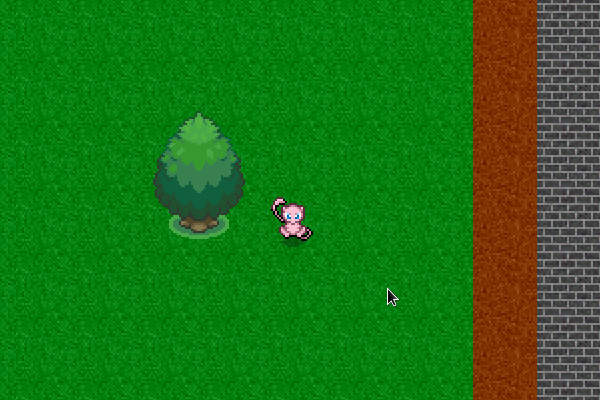

# About
+ A simple Java game that has no particular purpose at the moment.
+ Not everything is well optimized.

# Compile
+ Go to File > Project Structure > Libraries
  + After cloning, use InteliJ and add res folder as dependency.
  + Compile 
  + Run from main function in game.Launch.java found in src
  
# Controls

+ WSAD Controls
+ Shift to sprint
+ Arrow keys to attack an entity?
