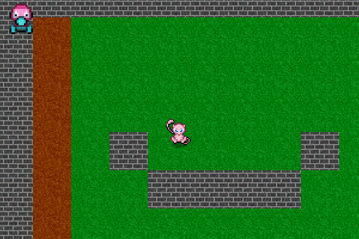

# About

+ A simple Java game that has no particular purpose at the moment.

# Compile

+ Go to File > Project Structure > Libraries
  + After cloning, use InteliJ and add res folder as dependency.
  + Compile 
  + Run from main function in game.Launch.java found in src
  
# Controls

+ WSAD Controls
+ Shift to sprint
+ Arrow keys to attack an entity

# Todo
+ Computation algorithim optimizations
+ Spacial partitioning collision detection
+ Enemy AI using BFS and relative positions 

